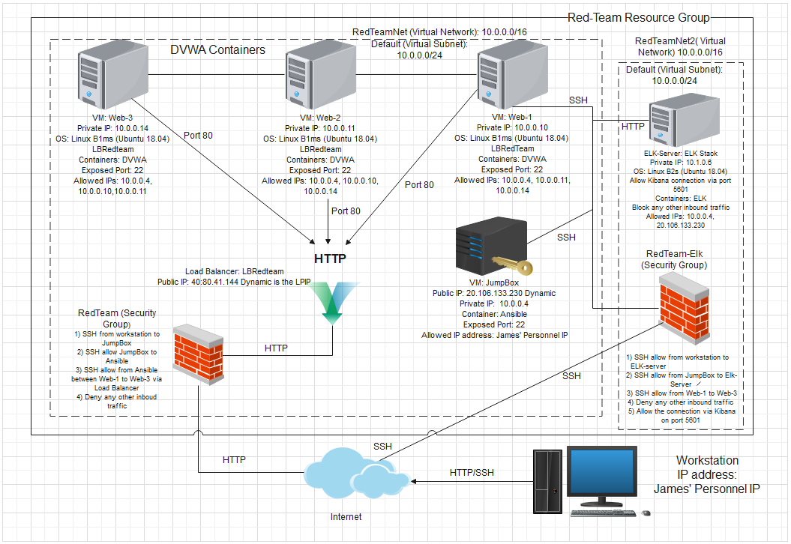
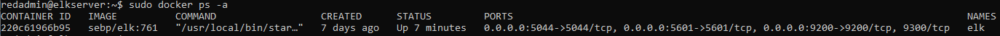

Automated ELK Stack Deployment

The files in this repository were used to configure the network depicted below.

These files have been tested and used to generate a live ELK deployment on Azure. They can be used to either recreate the entire deployment pictured above. Alternatively, select portions of the playbook file may be used to install only certain pieces of it, such as Filebeat.

Install Elk

Filebeat Playbook

Metricbeat Playbook

This document contains the following details:

- Description of the Topologu
- Access Policies
- ELK Configuration
  - Beats in Use
  - Machines Being Monitored
- How to Use the Ansible Build

Description of the Topology

The main purpose of this network is to expose a load-balanced and monitored instance of DVWA, the D*mn Vulnerable Web Application.

Load balancing ensures that the application will be highly available, in addition to restricting access to the network.

Integrating an ELK server allows users to easily monitor the vulnerable VMs for changes to the event logs and system metrics.
- Filebeat is installed as an agent on your VM Elk server or any server, Filebeat monitors specific log directories selected, collects log information, and forwards them either to Elasticsearch or Logstash for indexing.

- Metricbeat collects metrics and statistics and forwards them to Logstash or Elasticsearch. Metricbeat facilitates monitoring the metrics from system and services running on the server by viewing them on Kibana.

The configuration details of each machine may be found below.
_Note: Use the [Markdown Table Generator](http://www.tablesgenerator.com/markdown_tables) to add/remove values from the table_.

| Name       | Function              | IP Address | Operating System        |
|------------|-----------------------|------------|-------------------------|
| Jump-Box   | Gateway               | 10.0.0.4   | Linux (ubuntu 18.04 LTS)|
| Web-1      | Web Server-DVWA-Docker| 10.0.0.10  | Linux (ubuntu 18.04 LTS)|
| Web-2      | Web Server-DVWA-Docker| 10.0.0.11  | Linux (ubuntu 18.04 LTS)|
| Web-3      | Web Server-DVWA-Docker| 10.0.0.14  | Linux (ubuntu 18.04 LTS)|   
| ELK-Server | ELK Stack             | 10.1.0.6   | Linux (ubuntu 18.04 LTS)|

### Access Policies

The machines on the internal network are not exposed to the public Internet. 

Only the Jump Box machine can accept connections from the Internet. Access to this machine is only allowed from the following IP addresses:
James' Personal IP address

The private VM machines within the network can only be accessed by Jump-Box Provisioner.
The ELK-Server can be access by SSH from the Jump-Box and also from web access from James' Personnel IP address.

A summary of the access policies in place can be found in the table below.

| Name     | Publicly Accessible | Allowed IP Addresses |
|----------|---------------------|----------------------|
| Jump-Box | Yes                 | James' Personnel IP  |
| Web-1    | No                  | 10.0.0.10            |
| Web-2    | No                  | 10.0.0.11            |
| Web-3    | No                  | 10.0.0.14            |
### Elk Configuration

Ansible was used to automate configuration of the ELK machine. No configuration was performed manually, which is advantageous because
it deploys quickly and minimizes the probable for errors.

The playbook implements the following tasks:
- Install docker.io, pip3 and the docker module.
- Augments the virtual memory.
- Downloads and invokes the docker ELK container.
- Enable docker to start on boot.

The following screenshot displays the result of running `docker ps` after successfully configuring the ELK instance.

### Target Machines & Beats
This ELK server is configured to monitor the following machines:
Web-1: 10.0.0.10
Web-2: 10.0.0.11
Web-3: 10.0.0.14

We have installed the following Beats on these machines:
- Filebeat
- Metricbeat

These Beats allow us to collect the following information from each machine:
- Filebeat collects syslog logs such as auth.log (/var/log/auth.log), in order to identify/monitor who attempts to access each private VM machine.   
- Metricbeat allocates metrics such as memory, CPU and current running proccesses, these metrics can be used to identify/monitor performance or any redflags  
  on unwanted high running processes that can probably be a breach. 

### Using the Playbook
In order to use the playbook, you will need to have an Ansible control node already configured. Assuming you have such a control node provisioned: 

SSH into the control node and follow the steps below:
- Copy the configuration file to your ELK-server and private VM machines.
- Update the /etc/ansible/hosts file to include the internal IP addresses.

- Run the playbook, and navigate to http://[your.ELK-VMExternal.IP]:5601/app/kibana to check that the installation worked as expected.

- Which file is the playbook? Where do you copy it?
 The playbook is filebeat-config.yml and curl command is needed to get the filebeat-config to forward it into the correct directory on the Jump-Box Provisioner.

curl https://gist.githubusercontent.com/slape/5cc350109583af6cbe577bbcc0710c93/raw/eca603b72586fbe148c11f9c87bf96a63cb25760/Filebeat > /etc/ansible/filebeat-config.yml
 
- Which file do you update to make Ansible run the playbook on a specific machine? 

Update the hosts file in /etc/ansible/hosts

How do I specify which machine to install the ELK server on versus which to install Filebeat on?

On the intial lines of the playbook, you specify the hosts: 

---
- name: Installing and Launch Filebeat
  hosts: webservers
  become: yes
  tasks:

- Which URL do you navigate to in order to check that the ELK server is running?

http://[your.ELK-VMExternal.IP]:5601/app/kibana

Steps to set up ELK-server

1. Open Git Bash command prompt
2. ssh username@Jump-BoxJames'IP
3. sudo docker container list -a 

CONTAINER ID   IMAGE                           COMMAND                  CREATED        STATUS                      PORTS     NAMES
2e98ef1c6eab   cyberxsecurity/ansible:latest   "/bin/sh -c /bin/bas…"   47 hours ago   Exited (137) 10 hours ago             dreamy_satoshi
d354a79394f6   cyberxsecurity/ansible:latest   "/bin/sh -c /bin/bas…"   47 hours ago   Exited (137) 44 hours ago             distracted_saha

4. sudo docker start dreamy_satoshi && sudo docker attach dreamy_satoshi
dreamy_satoshi

5. nano /etc/ansible/hosts (add the internal private IP from the Elk-Server VM machine)
[elk]
10.1.0.6 ansible_python_interpreter=/usr/bin/python3

6  nano /etc/ansible/ansible.cfg (update remote user to the user name that you created for the public key for Microsoft Azure based on the Elk-Server VM machine)
7. nano /etc/ansible/elk-install.yml (create the YML file for the  ELK installation) 

[elk-install](Ansible/elk-install.yml)

8. ansible all -m ping (to ensure configurations and connection to the ELK-Server VM is successful)
9. ansible-playbook /etc/ansible/install-elk.yml (Deploy the elk installation to the internal private VM machines)
10. Type http://[PuplicIPfortheElkServer]:5601/app/kibana (Welcome to Kibana page should appear on the browser, that is successful setup)

Steps to installing filebeat

1. Open Git Bash command prompt
2. ssh username@Jump-BoxJames'IP
3. sudo docker container list -a 

CONTAINER ID   IMAGE                           COMMAND                  CREATED        STATUS                      PORTS     NAMES
2e98ef1c6eab   cyberxsecurity/ansible:latest   "/bin/sh -c /bin/bas…"   47 hours ago   Exited (137) 10 hours ago             dreamy_satoshi
d354a79394f6   cyberxsecurity/ansible:latest   "/bin/sh -c /bin/bas…"   47 hours ago   Exited (137) 44 hours ago             distracted_saha

4. sudo docker start dreamy_satoshi && sudo docker attach dreamy_satoshi
dreamy_satoshi

5. Run curl -L -O https://artifacts.elastic.co/downloads/beats/metricbeat/metricbeat-7.6.1-amd64.deb > /etc/ansible/metricbeat-config.yml
6. nano /etc/ansible/metricbeat-config.yml (update this file to ELK Server IP 10.1.0.6 under "hosts for setup.kibana" and under "hosts within output.elasticsearch:")
7. nano /etc/ansible/metricbeat-playbook.yml

8. ansible all -m ping
9. ansible-playbook /etc/ansible/filebeat-playbook.yml (deploys the metricbeat agent installation to the internal private VM machines)

[filebeat-playbook](Ansible/filebeat-playbook.yml)

Steps to installing metricbeat

1. Open Git Bash command prompt
2. ssh username@Jump-BoxJames'IP
3. sudo docker container list -a 

CONTAINER ID   IMAGE                           COMMAND                  CREATED        STATUS                      PORTS     NAMES
2e98ef1c6eab   cyberxsecurity/ansible:latest   "/bin/sh -c /bin/bas…"   47 hours ago   Exited (137) 10 hours ago             dreamy_satoshi
d354a79394f6   cyberxsecurity/ansible:latest   "/bin/sh -c /bin/bas…"   47 hours ago   Exited (137) 44 hours ago             distracted_saha

4. sudo docker start dreamy_satoshi && sudo docker attach dreamy_satoshi
dreamy_satoshi

5. curl -L -O https://artifacts.elastic.co/downloads/beats/metricbeat/metricbeat-7.6.1-amd64.deb > metricbeat-config.yml

6. nano /etc/ansible/metricbeat-config.yml (update this file to ELK Server IP 10.1.0.6 under "hosts for setup.kibana" and under "hosts within output.elasticsearch:")
7. nano /etc/ansible/metricbeat-playbook.yml (metricbeat setup for the internal IP VM machines)

[metricbeat-playbook](Ansible/metricbeat-playbook.yml)

8. ansible all -m ping (to ensure all configuration and connections are fine for metricbeat setup)
9. ansible-playbook /etc/ansible/metricbeat-playbook.yml (deploys the metricbeat agent installation to the internal private VM machines)
